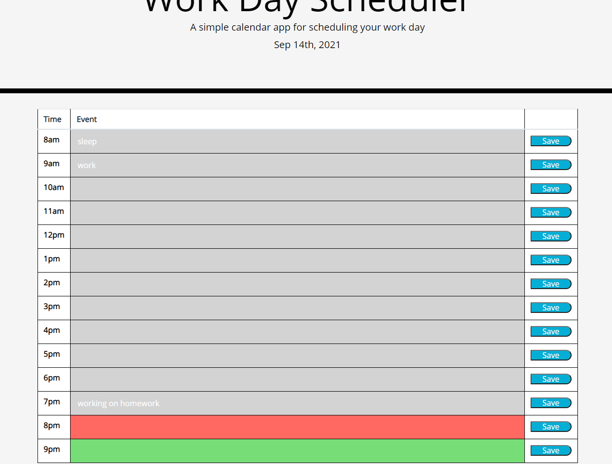

# Day-Planner

## Description
This project is a day planner that tracks a 12 hour day from 8am to 8pm. The planner shows you the current day and 12 time slots where you can write in your planned events and save them. The planner is built to color code the time blocks based on what time it is, grey is past, red is current time, and green is future. This planner was fairly simple in creating but the problem I was having was with the color coding function making sure that the whole block got shaded in and with the local storage because I was using jquery which I'm not as familiar with.

## Usage
To get started you will need to find the time block in which your event will take place, then you will type the name of your event and save. If you wish to delete the event simply select the event and backspace until its gone and then save again.

[livesite](https://krcano.github.io/Day-Planner/)

## MIT License

Copyright (c) [2021] [Kelly R. Cano]

Permission is hereby granted, free of charge, to any person obtaining a copy
of this software and associated documentation files (the "Software"), to deal
in the Software without restriction, including without limitation the rights
to use, copy, modify, merge, publish, distribute, sublicense, and/or sell
copies of the Software, and to permit persons to whom the Software is
furnished to do so, subject to the following conditions:

The above copyright notice and this permission notice shall be included in all
copies or substantial portions of the Software.

THE SOFTWARE IS PROVIDED "AS IS", WITHOUT WARRANTY OF ANY KIND, EXPRESS OR
IMPLIED, INCLUDING BUT NOT LIMITED TO THE WARRANTIES OF MERCHANTABILITY,
FITNESS FOR A PARTICULAR PURPOSE AND NONINFRINGEMENT. IN NO EVENT SHALL THE
AUTHORS OR COPYRIGHT HOLDERS BE LIABLE FOR ANY CLAIM, DAMAGES OR OTHER
LIABILITY, WHETHER IN AN ACTION OF CONTRACT, TORT OR OTHERWISE, ARISING FROM,
OUT OF OR IN CONNECTION WITH THE SOFTWARE OR THE USE OR OTHER DEALINGS IN THE
SOFTWARE.
